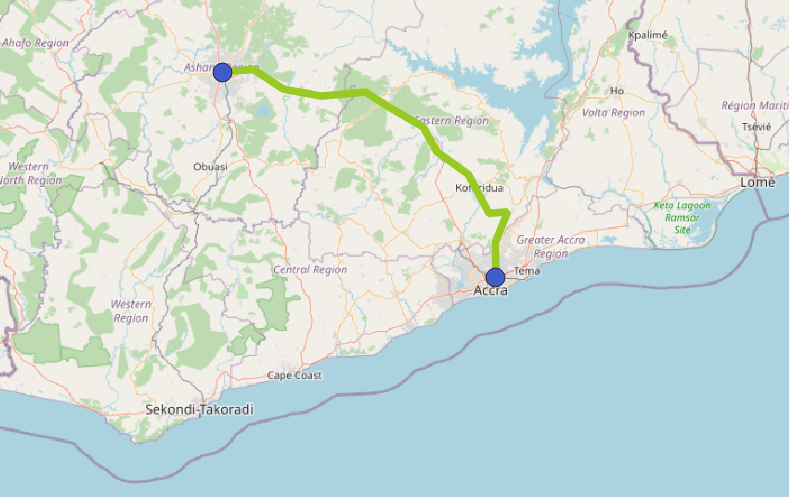
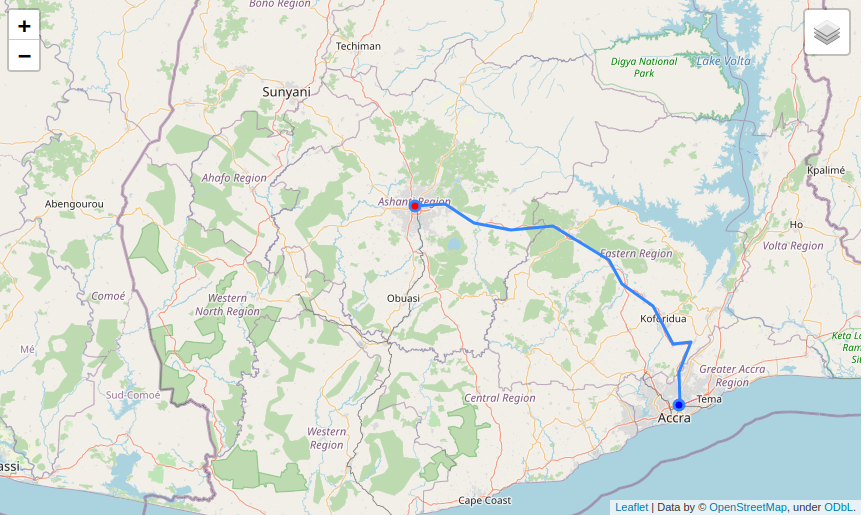

# How to use OFDS data

```{admonition} Alpha consultation
Welcome to the alpha release of the Open Fibre Data Standard.

We want to hear your feedback on the standard and its documentation. To find out how you can provide feedback, read the [alpha release announcement](https://github.com/Open-Telecoms-Data/open-fibre-data-standard/discussions/115).
```

This page provides [examples](#examples) that demonstrate how to use OFDS data in common tools and [how-to guides](#how-to-guides) for specific topics.

## Examples

### QGIS

The example QGIS file shows how to use [QGIS](https://qgis.org/) to visualise the example OFDS GeoJSON data.



To explore the example file:

1. Clone the [OFDS GitHub repository](https://github.com/Open-Telecoms-Data/open-fibre-data-standard).
2. Open `examples/qgis/geojson.qgs` in QGIS.
3. Explore the [attribute table](https://docs.qgis.org/3.22/en/docs/user_manual/working_with_vector/attribute_table.html) for the nodes and spans layers and use the [schema reference](../reference/schema.md) to look up the meaning of each attribute.

Alternatively, you can download the [example QGIS file](../../examples/qgis/geojson.qgs) and the example [nodes.geojson](../../examples/geojson/nodes.geojson) and [spans.geojson](../../examples/geojson/spans.geojson) files separately. However, when you open the example QGIS file you will need to use the [Handle Unavailable Layers](https://docs.qgis.org/3.22/en/docs/user_manual/introduction/project_files.html#handling-broken-file-paths) dialog to locate the nodes and spans files.

To recreate the example file:

1. [Load the `.geojson` files as vector data sources](https://docs.qgis.org/3.22/en/docs/user_manual/managing_data_source/opening_data.html#loading-a-layer-from-a-file) with the `FLATTEN_NESTED_ATTRIBUTES` option enabled. For more information on the options for loading GeoJSON data, see the [GDAL GeoJSON driver documentation](https://gdal.org/drivers/vector/geojson.html).
1. In the [symbology properties](https://docs.qgis.org/3.22/en/docs/user_manual/working_with_vector/vector_properties.html#symbology-properties) for each layer, choose the [categorized renderer](https://docs.qgis.org/3.22/en/docs/user_manual/working_with_vector/vector_properties.html#categorized-renderer) with the following classification values:
   * spans: `darkFibre`
   * nodes: `accessPoint`
1. Add a vector tile layer using the OpenStreetMap [XYZ Tile service](https://docs.qgis.org/3.22/en/docs/user_manual/managing_data_source/opening_data.html#using-xyz-tile-services).

### Leaflet

The example Leaflet notebook shows how to use [Python](https://www.python.org/), [Folium](http://python-visualization.github.io/folium/index.html) and [Leaflet](https://leafletjs.com/) to visualise the example OFDS GeoJSON data on a map. You can [download the notebook as an .ipynb file](../../examples/leaflet/leaflet.ipynb) or [view it in Deepnote](https://deepnote.com/viewer/github/Open-Telecoms-Data/open-fibre-data-standard/blob/main/examples/leaflet/leaflet.ipynb).



## How to guides

### How to plot coordinates accurately

Coordinates in OFDS data are specified in the `urn:ogc:def:crs:OGC::CRS84` [coordinate reference system](../reference/schema.md#coordinatereferencesystem) (CRS). To create accurate maps, you need need to set the correct coordinate reference system when using OFDS data.

If you are using OFDS data published in GeoJSON format, then the tool that you are using is likely to default to the correct CRS because `urn:ogc:def:crs:OGC::CRS84` is the default CRS for GeoJSON data.

If you are using OFDS data published in other formats, then you need to pay careful attention to coordinate ordering. `urn:ogc:def:crs:OGC::CRS84` is equivalent to EPSG:4326 with reversed axes so, if it is not supported by the tool that you are using, you can set your CRS to EPSG:4326 and ensure that you read coordinates in longitude, latitude order.

For more information on transforming coordinates from one CRS to another, see [how to transform coordinates to the correct coordinate reference system](publication.md#how-to-transform-coordinates-to-the-correct-coordinate-reference-system).
