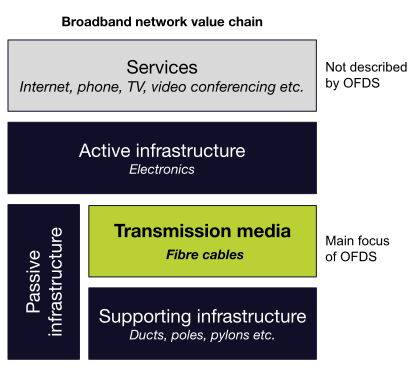
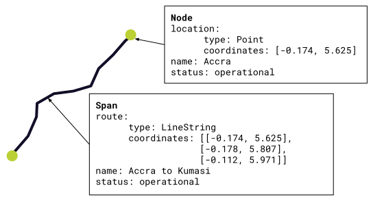
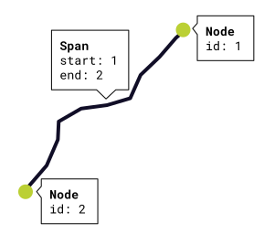
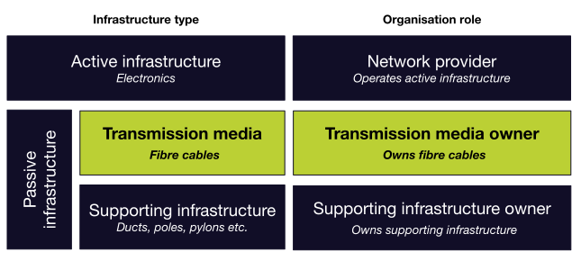

<!-- docs-type: explanation https://diataxis.fr/explanation/ -->

# Scope, focus and key concepts

This page explains the scope and focus of the Open Fibre Data Standard (OFDS) in the context of the three-layer broadband network value chain. It also introduces the key concepts and relationships covered in the OFDS data model.

## Scope and focus

OFDS provides a geospatial data model for describing fibre optic broadband networks, covering the location, organisational, technical and administrative attributes of fibre infrastructure. OFDS also provides three standardised representations of the data model in common data formats to support data exchange and publication.

````{grid} 2
:margin: 0
:padding: 0

```{grid-item}
To illustrate the scope and focus of OFDS, consider the three layers that make up the broadband network value chain:

* The **services** consumed by end-users, such as internet, TV and telephony.
* The **active infrastructure** over which services are delivered, consisting of electrical elements, such as lit fibre, access node switches and broadband remote access servers.
* The **passive infrastructure**, which consists of the non-electrical elements, such as dark fibre, ducts and physical sites.
```

```{grid-item}

```

````

The passive infrastructure can be further divided into **transmission media**, e.g. fibre cables, and **supporting infrastructure**, such as ducts, poles and pylons.

OFDS focuses primarily on describing the transmission media. It also accommodates some details about supporting infrastructure and active infrastructure, but it does not describe the services delivered across the infrastructure.

## Networks, nodes and spans

`````{grid} 2
:margin: 0
:padding: 0

````{grid-item}
:columns: 4
A network in the OFDS data model is a set of **nodes** interconnected by **spans**.

Nodes and spans are spatial entities, also known as features. They consist of a **geometry** that describes their location on the earth's surface, and **attributes** that describe technical and administrative characteristics.
````

````{grid-item}
:columns: 8

````

`````

A node is represented as a **Point** geometry and is defined as:

```{jsoninclude-quote} ../../schema/network-schema.json
:jsonpointer: /$defs/Node/description
```

A span is represented as a **LineString** geometry and is defined as:

```{jsoninclude-quote} ../../schema/network-schema.json
:jsonpointer: /$defs/Span/description
```

The following examples show how nodes and spans are represented in OFDS's JSON format. The examples include two attributes, `name` and `status`, that are common to both nodes and spans.


````{dropdown} Example: Node
:animate: fade-in-slide-down
:chevron: down-up


```json
{
  "id": "1",
  "location": {
    "type": "Point",
    "geometry": [-0.174, 5.625]
  },
  "name": "Accra",
  "status": "operational"
}
```

````

````{dropdown} Example: Span
:animate: fade-in-slide-down
:chevron: down-up

```json
{
  "id": "1",
  "route": {
    "type": "LineString",
    "geometry": [
      [-0.174, 5.625],
      [-0.178, 5.807],
      [-0.112, 5.971]
    ]
  },
  "name": "Accra to Kumasi",
  "status": "operational"
}
```

````


### Linking nodes and spans

````{grid} 2
:margin: 0
:padding: 0

```{grid-item}
Data on nodes and spans are often maintained as separate layers or datasets, without explicit references to describe the nodes to which each span connects.

In OFDS, each node is assigned an identifier so that it can be referenced by the spans that connect to it.

Explicitly linking nodes and spans means that data users can definitively know that a span connects to a node, without making assumptions based on geographical proximity.
```

```{grid-item}

```

````

### Organisational attributes

The OFDS data model describes three key roles for the organisations involved in a fibre network, each related to a different type of network infrastructure:

* **Network providers** operate active network infrastructure (e.g. lit fibre and network switches)
* **Transmission medium owners** own transmission media (e.g. fibre cables, splitters and combiners).
* **Supporting infrastructure owners** own supporting infrastructure (e.g. ducts, poles and pylons).



These relationships are declared as attributes of both nodes and spans. Therefore, OFDS can represent networks in which:

* Different fibre cables are owned by different organisations.
* Fibre cables and their supporting infrastructure are owned by different organisations.
* Network operators lease dark fibre owned by a different organisation.

The following example shows how the different organisation roles are modelled as attributes of a span in OFDS's JSON format.

````{dropdown} Example: Organisation roles
:animate: fade-in-slide-down
:chevron: down-up

In this example, a municipal council owns the duct through which fibre is deployed by a network operator named FibreCo. FibreCo operates its own active infrastructure and leases dark fibre to a second operator named FastNet.

```json
{
  "id": "1",
  "transmissionMediumOwner": {
    "id": "1",
    "name": "FibreCo"
  },
  "supportingInfrastructure": {
    "type": "duct",
    "owner": {
      "id": "2",
      "name": "Accra Municipal Council"
    }
  },
  "networkProviders": [
    {
      "id": "1",
      "name": "FibreCo"
    },
    {
      "id": "3",
      "name": "FastNet"
    }
  ]
}
```

````

### Technical attributes

In addition to the spatial and organisational characteristics of nodes and spans, the OFDS data model covers various technical attributes, including:

````{grid} 2

```{grid-item-card} Node attributes

* Function within the network (e.g. point of presence, internet exchange point, or add-drop site)
* Whether active or passive transmission equipment, which is capable of providing access to the network, is installed 
* Whether power for active network equipment is available
* The active technologies in use (e.g. MPLS)
* The type of supporting infrastructure (e.g. a building, pole or pylon). 

```

```{grid-item-card} Span attributes

* Fibre type (e.g. G.652)
* Fibres count
* The active technologies in use (e.g. DWDM)
* The transmission rate of the span
* The type of supporting infrastructure (e.g. duct, pole or pylon).

```

````

### Administrative attributes

The OFDS data model also incorporates administrative attributes of nodes and spans, including:

* Operational status
* Ready for service dates
* Availability of dark fibre, co-location space, and capacity for additional fibre cable installation
* The phases in which node and spans were deployed, information on funders and contracts for each phase

## Further reading

To learn more about the OFDS data model and its publication formats, refer to the reference documentation.