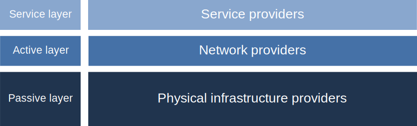

# Scope and key concepts

```{admonition} Alpha consultation
Welcome to the alpha release of the Open Fibre Data Standard.

We want to hear your feedback on the standard and its documentation. To find out how you can provide feedback, read the [alpha release announcement](https://github.com/Open-Telecoms-Data/open-fibre-data-standard/discussions/115).
```

This page explains the scope of the Open Fibre Data Standard (OFDS) in context of the three-layer [network value chain](#the-network-value-chain). It also introduces [key concepts](#key-concepts) that you need to understand in order to implement OFDS.

## The network value chain

Fibre optic networks broadly consist of three [layers](https://digital-strategy.ec.europa.eu/en/policies/broadband-network-layers-and-business-roles):

- The passive infrastructure layer consists of the non-electrical elements, such as dark fibre, ducts and physical sites
- The active infrastructure layer consists of the electrical elements, such as lit fiber, access node switches and broadband remote access servers
- The service layer consists of services consumed by end-users, such as internet, TV and telephony, which are delivered using the active infrastructure.


The primary focus of OFDS is to describe the passive network infrastructure. The standard also accommodates some details about the active infrastructure. The services that are delivered using the infrastructure are out of scope.

### Actors

Based on the layers in the network value chain, there are three main groups of actors in a fibre optic network:



Depending on the [business model](#network-business-models) used in a network, there can be one or more of each type of actor involved in a single network.

#### Physical infrastructure provider

OFDS defines a physical infrastructure provider as:

>An organisation that owns and maintains passive network infrastructure, i.e. the non-electrical elements, such as dark fibre, ducts and physical sites.

#### Network provider

OFDS defines a network provider as:

>An organisation that operates the active network infrastructure, i.e. the electrical elements, such as optical transceivers, switches and routers. In open business models, network providers provide wholesale access to service providers such as retail internet service providers. Network providers can own or lease the active network infrastructure.

#### Service provider

Service providers are organisations that deliver digital services across a network. For example, internet, e-health, elderly care, TV, phone, video-conferencing, entertainment, teleworking, smart monitoring etc. Service providers are out of scope of OFDS.

### Network business models

The actors in a fibre network can take on different roles depending on the business model(s) used in the network.

In a fully integrated model, one actor takes on all three roles, whilst in open networks the roles are separated. There are several possible business models for an open network:


## Key concepts

### Networks

OFDS defines a network as:

```{jsoninclude-quote} ../../schema/network-schema.json
:jsonpointer: /description
```


### Nodes

OFDS defines a node as:

```{jsoninclude-quote} ../../schema/network-schema.json
:jsonpointer: /definitions/Node/description
```

Nodes can represent different elements in a fibre network and the type of each node can be specified in the data, for example a node could be a point of presence, an internet exchange point and/or a cable landing.

For more information about nodes, see the [Node reference](../reference/schema.md#node).

### Links

OFDS defines a link as:

```{jsoninclude-quote} ../../schema/network-schema.json
:jsonpointer: /definitions/Link/description
```

The nodes that a link connects are known as its endpoints. In addition to the endpoints, the physical route of the link can also be specified as a LineString. This allows for the detailed route of a link to be published even when granular data on node locations along the link is unavailable, for example in a dataset describing a national backbone network.


For more information about links, see the [Link reference](../reference/schema.md#link).

### Geospatial data

Geospatial data is information that describes objects or features with a location on or near the surface of the earth. Geospatial data typically combines location information (usually coordinates on the earth) and attribute information (the characteristics of the object concerned).

OFDS data is usually geospatial data. It can contain both location information, such as the location of nodes and links, and attribute information, such as the capacity of a link.

OFDS data uses [GeoJSON geometry objects](https://www.rfc-editor.org/rfc/rfc7946#section-3.1) to represent location information. Nodes occupy single locations in space, so OFDS data uses the GeoJSON ['Point' geometry type](https://www.rfc-editor.org/rfc/rfc7946#section-3.1.2) to represent them. Links are connected paths, so OFDS data uses the GeoJSON ['LineString' geometry type](https://www.rfc-editor.org/rfc/rfc7946#section-3.1.4) to represent them.

Examples of OFDS node and link location data are given below.

::::{tab-set}

:::{tab-item} Node

```json
{
    "geometry": {
        "type": "Point",
        "coordinates": [
            26.081,
            -24.405
        ]
    }
}
```

:::

:::{tab-item} Link

```json
{
    "geometry": {
        "type": "LineString",
        "coordinates": [
            [
                26.081,
                -24.405
            ],
            [
                26.09,
                -24.416
            ]
        ]
    }
}
```

:::

::::

OFDS supports publishing geospatial data in several formats, for more information read the [publication format reference](../reference/index.md).
