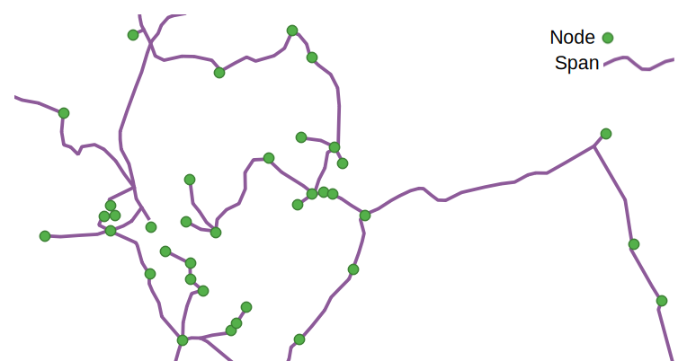

Scope and key concepts
============

## The network value chain

Fibre optic networks broadly consist of three [layers](https://digital-strategy.ec.europa.eu/en/policies/broadband-network-layers-and-business-roles):

- The passive infrastructure layer consists of the non-electrical elements, such as dark fibre, ducts and physical sites
- The active infrastructure layer consists of the electrical elements, such as lit fiber, access node switches and broadband remote access servers
- The service layer consists of services consumed by end-users, such as internet, TV and telephony, which are delivered using the active infrastructure.

The primary focus of OFDS is to describe the passive network infrastructure. The standard also accommodates some details about the active infrastructure. The services that are delivered using the infrastructure are out of scope.

## Actors

Based on the layers in the network value chain, there are three main actors in a fibre optic network:

- The passive infrastructure provider is an organization that owns, maintains and/or provides access to the passive network infrastructure, i.e. the non-electrical elements, such as dark fibre, ducts and physical sites.
- The active network provider is an organization that operates the active network infrastructure, i.e. the electrical elements, such as lit fiber, access node switches and broadband remote access servers. The network provider delivers service providers' services to end users. It can own or lease the active network infrastructure.
- The service provider is an organisation which delivers the digital services. For example: for e-health, elderly care, TV, Internet, phone, video-conferencing, entertainment, teleworking, smart monitoring and so on.

Other actors in fibre networks include investors in network infrastructure, end users of network services and wholesale customers of network providers.
OFDS covers passive infrastructure providers, active network providers and investors. However, service providers, end users and wholesale customers are out of scope.

## Network business models

The actors in a fibre network can take on different roles depending on the business model(s) used in the network.

In a fully integrated model, one actor takes on all three roles, whilst in open networks the roles are separated. There are several possible business models for an open network:

## Networks

OFDS defines a network as:
: A telecommunication network. A network consists of a set of nodes interconnected by links.

## Nodes

OFDS defines a node as:
: An access (entry or exit) point to a network. A node consists of active or passive equipment which is capable of providing access to the network. Sites at which there are no means of access to a network are not classified as nodes. Nodes can allow for interconnections to other networks and/or connections to end users.

Nodes can represent different elements in a fibre network and the type of each node can be specified in the data, for example a node could be a point of presence, an internet exchange point and/or a cable landing.

For more information about nodes, see the Node reference.

## Links

OFDS defines a link as:
: A non-directional connection between two nodes.

Links can be either direct physical connections between nodes, for example in granular data about an access network, or abstract connections between nodes, for example in less granular data about a national backbone network:

The nodes that a link connects are known as its endpoints. In addition to the endpoints, the physical route of the link can also be specified as a polyline. This allows for the detailed route of a link to be published even when granular data on node locations along the link is unavailable, for example in a dataset describing a national backbone network.

For more information about links, see the Link reference.

## Geo data
 
 To follow