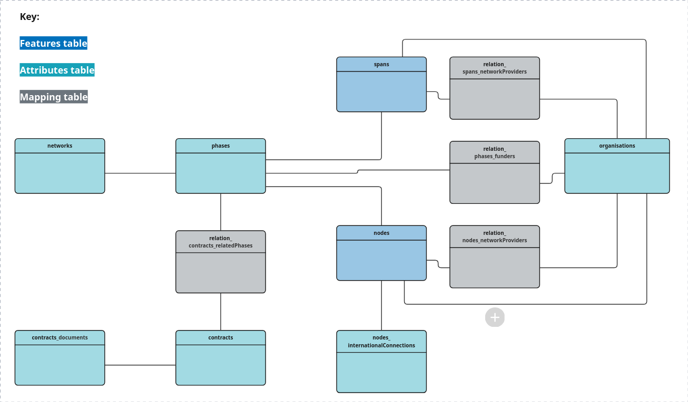

# GeoPackage

This page describes how to represent the [OFDS data model](../schema.md) as a [GeoPackage](https://www.geopackage.org/). It provides an [overview](#overview) of the structure of an OFDS GeoPackage, and detailed [definitions](#table-definitions) for each of the tables in the GeoPackage.

We provide an empty [OFDS GeoPackage template](../../../schema/template.gpkg) that implements the structure described on this page. The OFDS GeoPackage format is based on GeoPackage 1.Y.Z and uses the [GeoPackage Schema Extension](https://www.geopackage.org/spec140/#extension_schema) and [GeoPackage Related Tables Extension](https://docs.ogc.org/is/18-000/18-000.html).

## Overview

A single OFDS GeoPackage can contain multiple networks.

Spatial entities in the OFDS data model are represented as features in [Vector Feature User Data Tables](https://www.geopackage.org/spec140/#feature_user_tables), which contain both geometries and attributes. Non-spatial entities in the OFDS data model are represented as non-spatial attribute sets in [Attributes User Data Tables](https://www.geopackage.org/spec140/#attributes_user_tables), which contain only attributes and no geometries.

```{dropdown} Example: Spatial entities
:animate: fade-in-slide-down
:chevron: down-up

Nodes are spatial entities (a node's location is a Point geometry) so they are represented as spatial features in the `nodes` vector feature user data table.

```

```{dropdown} Example: Non-spatial entities
:animate: fade-in-slide-down
:chevron: down-up

Organisations are non-spatial entities (they have no associated geometry) so they are represented as non-spatial attribute sets in the `organisations` attributes user data table.


```

One-to-many (1:N) relationships (including array attributes) are represented as separate tables with foreign key relationships and many-to-many (M:N) relationships are represented as [User-Defined Mapping Tables](https://docs.ogc.org/is/18-000/18-000.html#user_defined_mapping_table).

````{dropdown} Example: 1:N relationships
:animate: fade-in-slide-down
:chevron: down-up

The 1:N relationship between a network and the nodes that belong to it is represented as a foreign key relationship from `nodes.network_id` to `networks.id`.

```{mermaid}

    erDiagram
        direction TB
        networks ||--o{ nodes : ""
        networks {
            INTEGER id PK
            TEXT name
    
        }
        nodes {
            INTEGER id PK
            INTEGER network_id FK
            TEXT name
            TEXT status
        }

```

````

````{dropdown} Example: M:N relationships
:animate: fade-in-slide-down
:chevron: down-up

The M:N relationship between a node and the organisations that operate active network infrastructure located at the node is represented by the `relation_nodes_networkProviders` user-defined mapping table, which relates records in the `nodes` table to records in the `organisations` table.  

```{mermaid}

    erDiagram
        direction TB
        nodes ||--o{ relation_nodes_networkProviders : ""
        relation_nodes_networkProviders }o--|| organisations : ""
        nodes {
            INTEGER id PK
            TEXT name
        }
        relation_nodes_networkProviders {
            INTEGER base_id FK
            INTEGER related_id FK
        }
        organisations {
            INTEGER id PK
            TEXT name
        }

```

````

The representation of attributes that reference a codelist depends on whether the attribute takes a single (text) value or an array of values from the codelist, and on whether the codelist is closed (i.e. the attributes value must belong to the codelist) or open (i.e. the attribute can take values that do not belong to the codelist).

```{dropdown} Examples
:animate: fade-in-slide-down
:chevron: down-up

Attribute data type | Codelist type | Representation | Example
--- | --- | --- | ---
Text | Closed | A column whose value is constrained to the codelist by an enum defined using the GeoPackage Schema Extension. | The Node Status attribute is represented by the `status` column in the `nodes` table, with an enum defined for the codes in the [nodeStatus codelist](../codelists.md#nodestatus).
Text | Open | A column with a foreign key relationship to a table containing the values in the codelist. | The Contract Type attribute is represented by the `type` column in the `contracts` table, with a foreign key to the `codelist_open_contractType` table, which contains the codes in the [contractType codelist](../codelists.md#contracttype).
Array | Open or Closed | An M:N relationship between the Vector Feature or Attributes User Data Table that represents the entity to which it belongs, and a table containing the values in the codelist. | The Node Type attribute is represented by the `type` column in the `nodes` table, with an M:N relationship (`relation_nodes_type`) to the `codelist_open_nodeType` table, which contains the codes in the [nodeType codelist](../codelists.md#nodetype).

```

The following diagram illustrates how the entities and relationships in the OFDS data model are represented in an OFDS GeoPackage. Codelist tables and their associated user-defined mapping tables are omitted for brevity. 



## Table definitions

### Vector Feature User Data Tables

Vector Feature User Data Tables represent spatial entities in the OFDS data model.

````{dropdown} nodes
:name: nodes
:color: primary
:animate: fade-in-slide-down
:chevron: down-up

Entity: [Node](../schema.md#node)

```{csv-table}
:file: ../../../metadata_reports/nodes.csv
```
````

````{dropdown} spans
:name: spans
:color: primary
:animate: fade-in-slide-down
:chevron: down-up

Entity: [Span](../schema.md#span)

```{csv-table}
:file: ../../../metadata_reports/spans.csv
```
````

### Attributes User Data Tables

Attributes User Data Tables represent non-spatial entities in the OFDS data model.

````{dropdown} networks
:name: networks
:color: info
:animate: fade-in-slide-down
:chevron: down-up

Entity: [Network](../schema.md#network)

```{csv-table}
:file: ../../../metadata_reports/networks.csv
```
````

````{dropdown} phases
:name: phases
:color: info
:animate: fade-in-slide-down
:chevron: down-up

Entity: [Phase](../schema.md#phase)

```{csv-table}
:file: ../../../metadata_reports/phases.csv
```
````

````{dropdown} organisations
:name: organisations
:color: info
:animate: fade-in-slide-down
:chevron: down-up

Entity: [Organisation](../schema.md#organisation)

```{csv-table}
:file: ../../../metadata_reports/organisations.csv
```
````

````{dropdown} contracts
:name: contracts
:color: info
:animate: fade-in-slide-down
:chevron: down-up

Entity: [Contract](../schema.md#contract)

```{csv-table}
:file: ../../../metadata_reports/contracts.csv
```
````

````{dropdown} contracts_documents
:name: contracts_documents
:color: info
:animate: fade-in-slide-down
:chevron: down-up

Entity: [Document](../schema.md#document)

```{csv-table}
:file: ../../../metadata_reports/contracts_documents.csv
```
````

````{dropdown} nodes_internationalConnections
:name: nodes_internationalConnections
:color: info
:animate: fade-in-slide-down
:chevron: down-up

Entity: [International connection](../schema.md#international-connection)

```{csv-table}
:file: ../../../metadata_reports/nodes_internationalConnections.csv
```
````

### Codelist tables

Each codelist table has the following columns:

```{csv-table}
:header: Name,Type,Not Null,Auto Increment

id,INTEGER,FALSE,TRUE
code,TEXT,FALSE,FALSE
description,TEXT,FALSE,FALSE
```

An OFDS GeoPackage includes the following codelist tables:

```{csv-table}
:header: Table,Codelist

`codelist_closed_country`, [country](../codelists.md#country)
`codelist_closed_deployment`, [deployment](../codelists.md#deployment)
`codelist_closed_transmissionMedium`, [transmissionMedium](../codelists.md#transmissionmedium)
`codelist_open_contractType`, [contractType](../codelists.md#contracttype)
`codelist_open_language`, [language](../codelists.md#language)
`codelist_open_mediaType`, [mediaType](../codelists.md#mediatype)
`codelist_open_nodeTechnologies`, [nodeTechnologies](../codelists.md#nodetechnologies)
`codelist_open_nodeType`, [nodeType](../codelists.md#nodetype)
`codelist_open_organisationIdentifierScheme`, [organisationIdentifierScheme](../codelists.md#organisationidentifierscheme)
`codelist_open_organisationrole`, [organisationrole](../codelists.md#organisationrole)
`codelist_open_spanTechnologies`, [spanTechnologies](../codelists.md#spantechnologies)

```

### User-Defined Mapping Tables

Each user defined mapping table has the following columns:

```{csv-table}
:header: Name,Type,Not Null,Auto Increment

base_id,INTEGER,TRUE,TRUE
related_id,INTEGER,TRUE,TRUE

```

An OFDS GeoPackage includes the following user-defined mapping tables:

```{csv-table}
:header: Table,base_id FK,related_id FK

`relation_nodes_networkProviders`,`nodes.id`,`organisations.id`
`relation_nodes_technologies`,`nodes.id`,`codelist_open_nodeTechnologies.id`
`relation_nodes_type`,`nodes.id`,`codelist_open_nodeType.id`
`relation_spans_networkProviders`,`spans.id`,`organisations.id`
`relation_spans_countries`,`spans.id`,`codelist_closed_country`
`relation_spans_deployment`,`nodes.id`,`codelist_closed_deployment`
`relation_spans_technologies`,`spans.id`,`codelist_open_spanTechnologies`
`relation_spans_transmissionMedium`,`spans.id`,`codelist_closed_transmissionMedium`
`relation_organisations_roles`,`organisations.id`,`codelist_open_organisationRole`
`relation_phases_funders`,`phases.id`,`organisations.id`
`relation_contracts_relatedPhases`,`contracts.id`,`phases.id`

```

## TO DO

- specify GeoPackage version
- integrate metadata script into manage.py, check that foreign keys and enums are pulled in correctly.
- list FKs separately
- update script to generate CSV of codelist tables, and relation tables.
