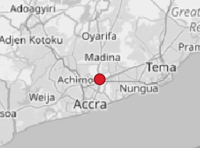

# GeoPackage

This page describes a standardised representation of the [OFDS data model](../schema.md) as a [GeoPackage](https://www.geopackage.org/). A GeoPackage is a [SQLite](https://sqlite.org/) database. This page provides an [overview](#overview) of the structure of an OFDS GeoPackage, and detailed [definitions](#table-definitions) for each of the tables in the database.

The OFDS GeoPackage format is based on [GeoPackage 1.4.0](https://www.geopackage.org/spec140/), including the [GeoPackage Schema Extension](https://www.geopackage.org/spec140/#extension_schema) and [GeoPackage Related Tables Extension](https://docs.ogc.org/is/18-000/18-000.html).

## Template

The [OFDS GeoPackage template](../../../schema/geopackage/network-schema.gpkg) implements the structure described on this page.

```{tip}
You can explore the structure of the OFDS GeoPackage template in common GIS tools such as [QGIS](https://qgis.org/), or you can connect directly to the SQLite database using your preferred SQL client. 
```

## Overview

The following diagram illustrates how the main entities and relationships in the OFDS data model are represented in an OFDS GeoPackage. Features (spatial entities) are coloured yellow, non-spatial entities are coloured blue, and associative tables (M:N relationships) are coloured grey.

```{mermaid} geopackage.mmd
:zoom:
```

### Features (spatial entities)

Nodes and spans are represented as features in [Vector Feature User Data Tables](https://www.geopackage.org/spec140/#feature_user_tables), which contain both geometries and attributes.

`````{dropdown} Example: Nodes
:animate: fade-in-slide-down
:chevron: down-up

[Nodes](../schema.md#node) are spatial entities with a Point geometry so they are represented as spatial features in the [`nodes` vector feature user data table](#nodes).

Node geometries are stored in the `geom` column of the `nodes` table in [GeoPackage SQL Geometry Binary Format](https://www.geopackage.org/spec140/#gpb_spec). Node attributes are stored in the other columns of the `nodes` table.

````{grid} 2

```{grid-item-card} Geometry



```

```{grid-item-card} Attributes

id | name | status
--- | --- | ---
1 | Accra | operational

```

````

`````

### Non-spatial entities

Non-spatial entities, such as organisations, are represented as non-spatial attribute sets in [Attributes User Data Tables](https://www.geopackage.org/spec140/#attributes_user_tables), which contain only attributes and no geometries.

````{dropdown} Example: Organisations
:animate: fade-in-slide-down
:chevron: down-up

[Organisations](../schema.md#organisation) are non-spatial entities (they have no associated geometry) so they are represented as non-spatial attribute sets in the [`organisations` attributes user data table](#organisations).

```{card} Attributes

id | name | country | website
--- | --- | --- | ---
1 | FibreCo | gh | http://www.example.com

````

### One-to-many relationships

One-to-many (1:N) relationships between entities in the OFDS data model, such as a [network](../schema.md#network) with many [nodes](../schema.md#node), are represented as [foreign key](https://en.wikipedia.org/wiki/Foreign_key) relationships. Attributes of type array in the OFDS data model, such as a [span](../schema.md#span)'s transmission medium are also represented as foreign key relationships.


````{dropdown} Example: Networks and nodes
:animate: fade-in-slide-down
:chevron: down-up

The 1:N relationship between a network and the nodes that belong to it is represented as a foreign key (`network_id`) in the [`nodes` table](#nodes) that references the `id` field in the [`networks` table](#networks).

```{mermaid}

    erDiagram
        direction TB
        networks ||--o{ nodes : ""
        networks {
            INTEGER id PK "1"
            TEXT name "Ghana Fibre Network"
    
        }
        nodes {
            INTEGER id PK "1"
            BLOB geom "..."
            INTEGER network_id FK "1"
            TEXT name "Accra"
            TEXT status "operational"
        }

        classDef feature fill:#f3ffa6ff,stroke:#bbd034
        classDef attribute fill:#cec7ffff,stroke:#110e27

        class nodes feature
        class networks attribute

```

````

### Many-to-many relationships

Many-to-many (M:N) relationships, such as a node with many network providers, are represented as [User-Defined Mapping Tables](https://docs.ogc.org/is/18-000/18-000.html#user_defined_mapping_table).

````{dropdown} Example: M:N relationships
:animate: fade-in-slide-down
:chevron: down-up

The M:N relationship between a [node](../schema.md#node) and the organisations that operate active network infrastructure located at the node is represented by the `relation_nodes_networkProviders` user-defined mapping table.

The mapping table relates records in the [`nodes` table](#nodes) to records in the [`organisations` table](#organisations).

```{mermaid}

    erDiagram
        direction TB
        nodes ||--o{ relation_nodes_networkProviders : ""
        relation_nodes_networkProviders }o--|| organisations : ""
        nodes {
            INTEGER id PK "1"
            BLOB geom "..."
            TEXT name "Accra"
        }
        relation_nodes_networkProviders {
            INTEGER base_id FK "1"
            INTEGER related_id FK "1"
        }
        organisations {
            INTEGER id PK "1"
            TEXT name "FibroCo"
        }

        classDef feature fill:#f3ffa6ff,stroke:#bbd034
        classDef attribute fill:#cec7ffff,stroke:#110e27
        classDef mapping fill:#efefefff,stroke:#434343ff

        class nodes feature
        class organisations attribute
        class relation_nodes_networkProviders mapping

```

````

### Codelists

Some attributes in the OFDS data model refer to [codelists](../codelists.md) to limit and standardise the possible values of the attribute. 

The representation of attributes that reference a codelist depends on whether the attribute takes a single value or an array of values from the codelist, and on whether the codelist is closed (i.e. the attributes value must belong to the codelist) or open (i.e. the attribute can take values that do not belong to the codelist):

Attribute data type | Codelist type | Representation
--- | --- | ---
Text | Closed | A column whose value is constrained to the codelist by an enum defined using the GeoPackage Schema Extension.
Text | Open | A column with a foreign key relationship to a table containing the values in the codelist.
Array | Open or Closed | An M:N relationship between the Vector Feature or Attributes User Data Table that represents the entity to which the attribute belongs, and a table containing the values in the codelist.

````{dropdown} Example: Text attribute with a closed codelist
:animate: fade-in-slide-down
:chevron: down-up

The Node Status attribute is represented by the `status` column in the [`nodes` table](#nodes), with an enum defined for the codes in the [nodeStatus codelist](../codelists.md#nodestatus).

```{card} nodes table

id | name | status
--- | --- | ---
1 | Accra | operational
2 | Kumasi | underConstruction

```

```{card} enum

value | description
--- | ---
proposed | Proposed: Planning for the node is at an early stage and financing for its construction is not yet finalised.
planned | Planned: Planning for the node is at an advanced stage and financing for its construction is finalised.
underConstruction | Under construction: Construction of the passive physical infrastructure for the node is in progress.
inactive | Inactive: Construction of the passive network infrastructure is complete, but the node is not yet operational.
operational | Operational: The active network infrastructure for at least one network provider at the node is live and carrying traffic.
decommissioned | Decommissioned: The node is no longer operational.

```

````

````{dropdown} Example: Text attribute with an open codelist
:animate: fade-in-slide-down
:chevron: down-up

The Contract Type attribute is represented by the `type` column in the [`contracts` table](#contracts), with a foreign key to the `codelist_open_contractType` [codelist table](#codelist-tables), which contains the codes in the [contractType codelist](../codelists.md#contracttype).


```{mermaid}

    erDiagram
        direction TB
        codelist_open_contractType ||--o{ contracts : ""
        codelist_open_contractType {
            INTEGER id PK "1"
            TEXT code "ppp"
            TEXT description "Public Private Partnership (PPP): A long-term contract..."
    
        }
        contracts {
            INTEGER id PK "2"
            TEXT title "NextGen Phase 2 Construction Contract"
            INTEGER type FK "1"
        }

        classDef attribute fill:#cec7ffff,stroke:#110e27

        class codelist_open_contractType attribute

```

```{card} contracts table

id | title | type
--- | --- | ---
1 | NextGen Phase 1 Construction Contract | 2
2 | NextGen Phase 2 Construction Contract | 1

```

```{card} codelist_open_contractType table

id | code | description
--- | --- | ---
1 | ppp | Public Private Partnership (PPP): A long-term contract between a private party and a government entity,for providing a public asset or service,in which the private party bears significant risk and management responsibility and remuneration is linked to performance.
2 | private | Private: A contract in which the private sector takes ownership of the network and responsibility for its operation.
3 | public | Public: A contract in which the public sector owns the network and is responsible for its operation.

```

````

````{dropdown} Example: Array attribute with a codelist
:animate: fade-in-slide-down
:chevron: down-up

The Node Type attribute is represented by the `type` column in the [`nodes` table](#nodes), with an M:N relationship (`relation_nodes_type`) to the `codelist_open_nodeType` [codelist table](#codelist-tables), which contains the codes in the [nodeType codelist](../codelists.md#nodetype).


```{mermaid}

    erDiagram
        direction TB
        nodes ||--o{ relation_nodes_type : ""
        relation_nodes_type }o--|| codelist_open_nodeType : ""
        
        nodes {
            INTEGER id PK "1"
            TEXT name "Accra"
        }
        relation_nodes_type {
            INTEGER base_id FK "1"
            INTEGER related_id FK "1"
        }
        codelist_open_nodeType {
            INTEGER id PK "1"
            TEXT code "addDropSite"
            TEXT description "Add drop site: A point at which..."
        }

        classDef feature fill:#f3ffa6ff,stroke:#bbd034
        classDef mapping fill:#efefefff,stroke:#434343ff

        class nodes feature
        class relation_nodes_type mapping

```

```{card} nodes table

id | name
--- | ---
1 | Accra

```

```{card} codelist_open_nodeType table

id | code | description
--- | --- | ---
1 | addDropSite | Add drop site: A point at which individual digital bit streams can be added to, or dropped from, a multiplexed signal in order to redirect bit streams between network paths.

```

```{card} relation_nodes_type table

base_id | related_id
--- | ---
1 | 1

````

## Table definitions

### Vector feature user data tables

Vector Feature User Data Tables represent [spatial entities](#features-spatial-entities) in the OFDS data model.

````{dropdown} nodes
:name: nodes
:class-title: feature-drop-down
:animate: fade-in-slide-down
:chevron: down-up

**Columns**

```{csv-table}
:file: ../../../schema/geopackage/table_definitions/nodes.csv
:header-rows: 1
```

**Foreign keys**

```{csv-table}
:file: ../../../schema/geopackage/table_definitions/nodes_fks.csv
:header-rows: 1
```

````

````{dropdown} spans
:name: spans
:class-title: feature-drop-down
:animate: fade-in-slide-down
:chevron: down-up

**Columns**

```{csv-table}
:file: ../../../schema/geopackage/table_definitions/spans.csv
:header-rows: 1
```

**Foreign keys**

```{csv-table}
:file: ../../../schema/geopackage/table_definitions/spans_fks.csv
:header-rows: 1
```


````

### Attributes user data tables

Attributes User Data Tables represent [non-spatial entities](#non-spatial-entities) in the OFDS data model.

````{dropdown} networks
:name: networks
:class-title: attribute-drop-down
:animate: fade-in-slide-down
:chevron: down-up

**Columns**

```{csv-table}
:file: ../../../schema/geopackage/table_definitions/networks.csv
:header-rows: 1
```

**Foreign keys**

```{csv-table}
:file: ../../../schema/geopackage/table_definitions/networks_fks.csv
:header-rows: 1
```

````

````{dropdown} phases
:name: phases
:class-title: attribute-drop-down
:animate: fade-in-slide-down
:chevron: down-up

**Columns**

```{csv-table}
:file: ../../../schema/geopackage/table_definitions/phases.csv
:header-rows: 1
```

**Foreign keys**

```{csv-table}
:file: ../../../schema/geopackage/table_definitions/phases_fks.csv
:header-rows: 1
```

````

````{dropdown} organisations
:name: organisations
:class-title: attribute-drop-down
:animate: fade-in-slide-down
:chevron: down-up

**Columns**

```{csv-table}
:file: ../../../schema/geopackage/table_definitions/organisations.csv
:header-rows: 1
```

**Foreign keys**

```{csv-table}
:file: ../../../schema/geopackage/table_definitions/organisations_fks.csv
:header-rows: 1
```

````

````{dropdown} contracts
:name: contracts
:class-title: attribute-drop-down
:animate: fade-in-slide-down
:chevron: down-up

**Columns**

```{csv-table}
:file: ../../../schema/geopackage/table_definitions/contracts.csv
:header-rows: 1
```

**Foreign keys**

```{csv-table}
:file: ../../../schema/geopackage/table_definitions/contracts_fks.csv
:header-rows: 1
```

````

````{dropdown} contracts_documents
:name: contracts_documents
:class-title: attribute-drop-down
:animate: fade-in-slide-down
:chevron: down-up

**Columns**

```{csv-table}
:file: ../../../schema/geopackage/table_definitions/contracts_documents.csv
:header-rows: 1
```

**Foreign keys**

```{csv-table}
:file: ../../../schema/geopackage/table_definitions/contracts_documents_fks.csv
:header-rows: 1
```

````

````{dropdown} nodes_internationalConnections
:name: nodes_internationalConnections
:class-title: attribute-drop-down
:animate: fade-in-slide-down
:chevron: down-up

**Columns**

```{csv-table}
:file: ../../../schema/geopackage/table_definitions/nodes_internationalConnections.csv
:header-rows: 1
```

**Foreign keys**

```{csv-table}
:file: ../../../schema/geopackage/table_definitions/nodes_internationalConnections_fks.csv
:header-rows: 1
```

````

### Codelist tables

Each codelist table has the following columns:

```{csv-table}
:header: Name,Type,Not Null,Auto Increment

id,INTEGER,FALSE,TRUE
code,TEXT,FALSE,FALSE
description,TEXT,FALSE,FALSE
```

An OFDS GeoPackage includes the following codelist tables:

```{csv-table}
:header: Table,Codelist
:file: ../../../schema/geopackage/table_definitions/codelist_tables.csv

```

### User-defined mapping tables

Each user defined mapping table has the following columns:

```{csv-table}
:header: Name,Type,Not Null,Auto Increment

base_id,INTEGER,TRUE,TRUE
related_id,INTEGER,TRUE,TRUE

```

An OFDS GeoPackage includes the following user-defined mapping tables:

```{csv-table}
:header: Table,base_id FK,related_id FK
:file: ../../../schema/geopackage/table_definitions/mapping_tables.csv


```
