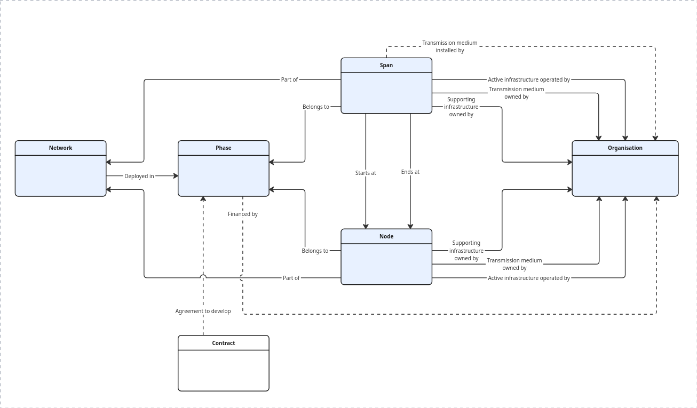

<!-- docs-type: reference https://diataxis.fr/reference/ -->

# Data model

OFDS defines a data model for describing a fibre network. The data model is a logical model that defines the entities, attributes and relationships needed to describe a fibre network. This page defines the data model without reference to its representation in a particular data format. It provides an [overview](#overview) of the data model and [reference tables](#entities) for each entity.

OFDS also defines three standardised representations of the data model in different [data formats](publication_formats/index.md) (JSON, CSV/WKT, and GeoPackage), which can be used to store, publish or exchange OFDS data.

## Overview

The following diagram provides an overview of the entities and relationships in the data model:



As described in the [scope and key concepts primer](../primer/scopeandkeyconcepts.md), OFDS's primary focus is to describe transmission media (e.g. fibre cables). As such, the `Node` and `Span` entities represent the transmission media, but include attributes relating to the supporting infrastructure for the transmission media (e.g. ducts) and the active infrastructure operating over the transmission media (e.g. lit fibre). Notably, there are separate attributes for the owner of the transmission media, the owner of the supporting infrastructure, and the operator of the active infrastructure (the network provider), each modelled as a reference to an organisation.

## Entities

This section provides a definition for each entity, including a description, relationships to other entities, and attributes.

### Network

````{dropdown} Description
:open:
:animate: fade-in-slide-down
:chevron: down-up
:icon: book
```{jsoninclude-quote} ../../schema/network-schema.json
:jsonpointer: /description
```
````

```{dropdown} Relationships
:open:
:animate: fade-in-slide-down
:chevron: down-up
:icon: link

- [Node](#node): one-to-many
- [Span](#span): one-to-many
- [Phase](#phase): one-to-many
- [Organisation](#organisation):
   - All roles: one-to-many
- [Contract](#contract): one-to-many
```

````{dropdown} Attributes
:open:
:animate: fade-in-slide-down
:chevron: down-up
:icon: rows

```{jsonschema} ../../schema/network-schema.json
:include: id,name,website
:nocrossref:
```

````

### Phase

````{dropdown} Description
:open:
:animate: fade-in-slide-down
:chevron: down-up
:icon: book

```{jsoninclude-quote} ../../schema/network-schema.json
:jsonpointer: /$defs/Phase/description
```
````

```{dropdown} Relationships
:open:
:animate: fade-in-slide-down
:chevron: down-up
:icon: link

- [Network](#network): many-to-one
- [Node](#node): one-to-many
- [Span](#span): one-to-many
- [Organisation](#organisation):
   - Funder: one-to-many
- [Contract](#contract): many-to-one
```

````{dropdown} Attributes
:open:
:animate: fade-in-slide-down
:chevron: down-up
:icon: rows

```{jsonschema} ../../schema/network-schema.json
:pointer: /$defs/Phase
:include: id,name,description
:nocrossref:
```

````

### Node

````{dropdown} Description
:open:
:animate: fade-in-slide-down
:chevron: down-up
:icon: book

```{jsoninclude-quote} ../../schema/network-schema.json
:jsonpointer: /$defs/Node/description
```
````

```{dropdown} Relationships
:open:
:animate: fade-in-slide-down
:chevron: down-up
:icon: link

- [Network](#network): many-to-one
- [Phase](#phase): many-to-one
- [Span](#span): many-to-many
- [Organisation](#organisation):
   - Transmission medium owner: many-to-one
   - Supporting infrastructure owner: many-to-one
   - Network provider: many-to-many
```

````{dropdown} Attributes
:open:
:animate: fade-in-slide-down
:chevron: down-up
:icon: rows

```{jsonschema} ../../schema/network-schema.json
:pointer: /$defs/Node
:include: id,name,status,location,address/streetAddress,address/locality,address/region,address/postalCode,address/country,type,accessPoint,power,technologies
:collapse: location
:nocrossref:
```

````

### Span

````{dropdown} Description
:open:
:animate: fade-in-slide-down
:chevron: down-up
:icon: book

```{jsoninclude-quote} ../../schema/network-schema.json
:jsonpointer: /$defs/Span/description
```
````

```{dropdown} Relationships
:open:
:animate: fade-in-slide-down
:chevron: down-up
:icon: link

- [Network](#network): many-to-one
- [Phase](#phase): many-to-one
- [Node](#node): many-to-one
- [Organisation](#organisation):
   - Transmission medium owner: many-to-one
   - Supporting infrastructure owner: many-to-one
   - Network provider: many-to-many
   - Supplier: many-to-one
```

````{dropdown} Attributes
:open:
:animate: fade-in-slide-down
:chevron: down-up
:icon: rows

```{jsonschema} ../../schema/network-schema.json
:pointer: /$defs/Span
:include: id,name,status,readyForServiceDate,directed,route,transmissionMedium,deploymentDetails,darkFibre,fibreType,fibreTypeDetails/fibreSubtype,fibreTypeDetails/description,fibreCount,fibreLength,technologies,capacity,capacityDetails/description,countries
:nocrossref:
```

````

### Organisation

````{dropdown} Description
:open:
:animate: fade-in-slide-down
:chevron: down-up
:icon: book

```{jsoninclude-quote} ../../schema/network-schema.json
:jsonpointer: /$defs/Organisation/description
```
````

```{dropdown} Relationships
:open:
:animate: fade-in-slide-down
:chevron: down-up
:icon: link

- [Network](#network): many-to-one
- [Phase](#phase) (funder): many-to-one
- [Node](#node):
   - Transmission medium owner: one-to-many
   - Supporting infrastructure owner: one-to-many
   - Network provider: many-to-many
- [Span](#span):
   - Transmission medium owner: one-to-many
   - Supporting infrastructure owner: one-to-many
   - Network provider: many-to-many
   - Supplier: one-to-many
```

````{dropdown} Attributes
:open:
:animate: fade-in-slide-down
:chevron: down-up
:icon: rows

```{jsonschema} ../../schema/network-schema.json
:pointer: /$defs/Organisation
:include: id,name,identifier/id,identifier/scheme,identifier/legalName,identifier/uri,country,roles,roleDetails,website,logo
:nocrossref:
```

````

### Contract

````{dropdown} Description
:open:
:animate: fade-in-slide-down
:chevron: down-up
:icon: book

```{jsoninclude-quote} ../../schema/network-schema.json
:jsonpointer: /$defs/Contract/description
```
````

```{dropdown} Relationships
:open:
:animate: fade-in-slide-down
:chevron: down-up
:icon: link

- [Network](#network): many-to-one
- [Phase](#phase): one-to-many
```

````{dropdown} Attributes
:open:
:animate: fade-in-slide-down
:chevron: down-up
:icon: rows

```{jsonschema} ../../schema/network-schema.json
:pointer: /$defs/Contract
:include: id,title,description,type,value/amount,value/currency,dateSigned
:nocrossref:
```

````

### Document

````{dropdown} Description
:open:
:animate: fade-in-slide-down
:chevron: down-up
:icon: book

```{jsoninclude-quote} ../../schema/network-schema.json
:jsonpointer: /$defs/Document/description
```
````

```{dropdown} Relationships
:open:
:animate: fade-in-slide-down
:chevron: down-up
:icon: link

- [Network](#network): many-to-one
- [Contract](#phase): one-to-many
```

````{dropdown} Attributes
:open:
:animate: fade-in-slide-down
:chevron: down-up
:icon: rows

```{jsonschema} ../../schema/network-schema.json
:pointer: /$defs/Document
:nocrossref:
```

````

### International connection

````{dropdown} Description
:open:
:animate: fade-in-slide-down
:chevron: down-up
:icon: book

```{jsoninclude-quote} ../../schema/network-schema.json
:jsonpointer: /$defs/Address/description
```
````

```{dropdown} Relationships
:open:
:animate: fade-in-slide-down
:chevron: down-up
:icon: link

- [Network](#network): many-to-one
- [Nodes](#phase): one-to-many
```

````{dropdown} Attributes
:open:
:animate: fade-in-slide-down
:chevron: down-up
:icon: rows

```{jsonschema} ../../schema/network-schema.json
:pointer: /$defs/Address
:nocrossref:
```

````

# TO DO:

- work out what to do about Node.internationalConnections (currently a different entity, essentially) > suggest updating to Node.internationalConnections.countries
   - same for Contract.documents
- add more on organisation roles to the overview
- consider whether to put the whole overview in the primer and just have the diagram and reference tables on this page
- work out what to do about information in object descriptions
- decide whether to relate all entities to a network, or just nodes and spans
- potentially make a clickable image map
- consider providing a table with definitions and examples for each relationship
- decide what to do about publisher, publicationDate, crs, language